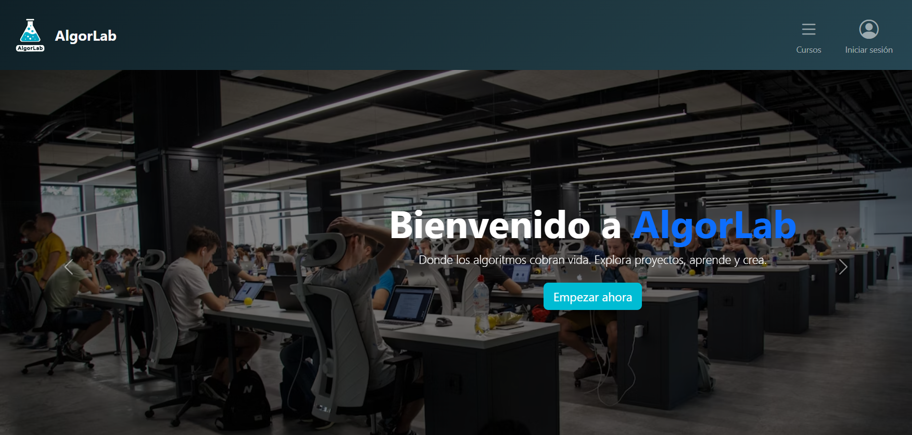
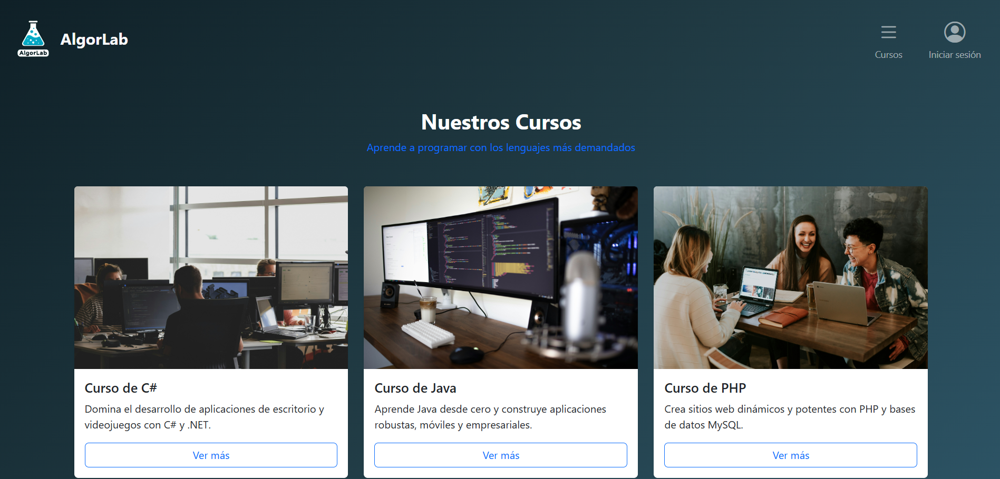
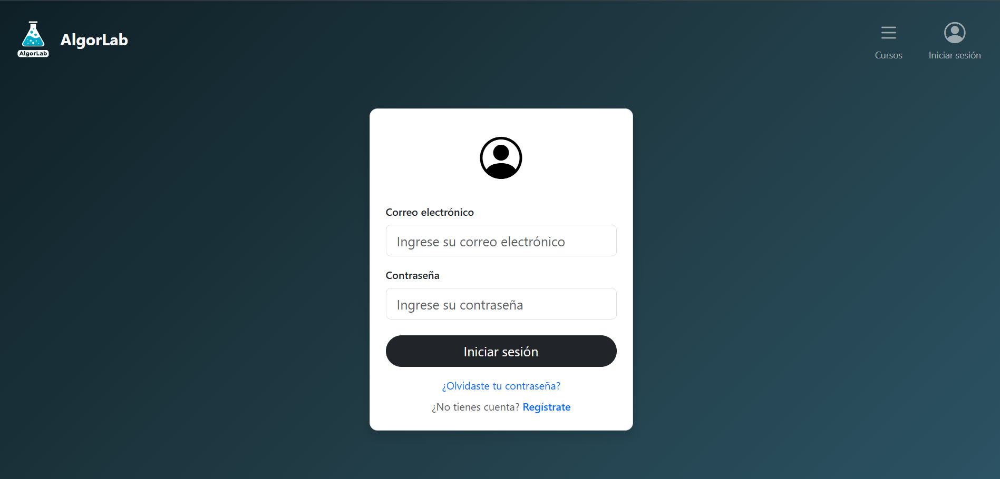
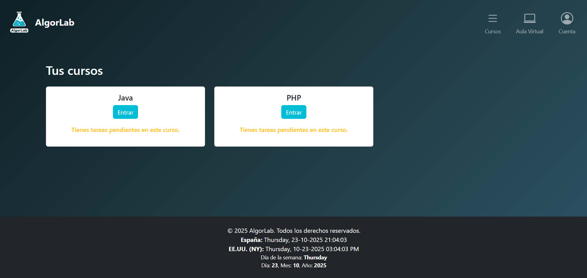
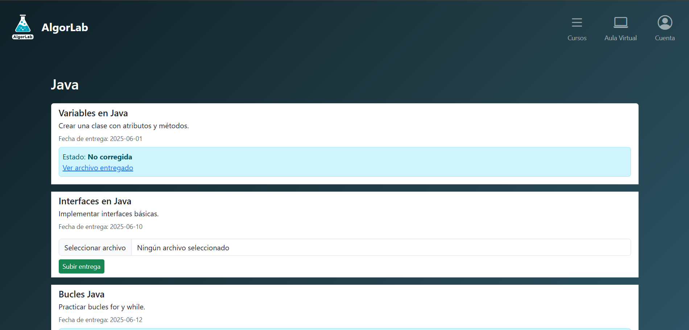
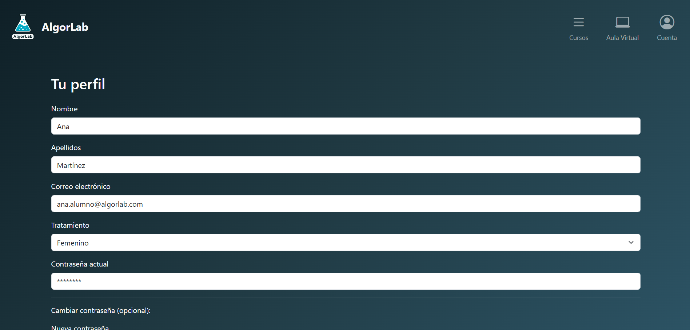

# 🌐 AlgorLab Web / AlgorLab Web

---

## 🇪🇸 Español

**AlgorLab Web** es la versión web complementaria de la aplicación de escritorio **AlgorLab**, diseñada para que los **alumnos** puedan acceder a su información académica desde cualquier navegador.  

Esta web fue creada como parte del proyecto AlgorLab, mientras que la app de escritorio está enfocada en el **profesorado y dirección**.

Esta fue la **web final de primero** aplicando los conocimientos aprendidos en **el primer año del ciclo** orientada a una **moodle**.


### 📁 Estructura del proyecto

```
AlgorLab_Web_Final/
├── images/           # Capturas de pantalla de la web
├── css/              # Archivos de estilo
├── js/               # Scripts de JavaScript
├── index.php         # Página principal
├── otros archivos PHP # Funcionalidades del backend
└── README.md         # Este archivo
```

### 🖼️ Capturas de pantalla

#### Página principal


#### Login


#### Gestión de alumnos


#### Gestión de tareas


#### Entregas


#### Vista profesor


### 🛠️ Tecnologías utilizadas

- PHP  
- HTML5  
- CSS3  
- JavaScript

---

## 🇬🇧 English

**AlgorLab Web** is the web version complementing the **AlgorLab** desktop application, designed for **students** to access their academic information from any browser.  

This web was created as part of the AlgorLab project, while the desktop app is focused on **teachers and school management**.

This was the **final website of the first year**, applying the knowledge learned in **the first year of the program**, oriented towards a **Moodle**.

### 📁 Project Structure

```
AlgorLab_Web_Final/
├── images/           # Website screenshots
├── css/              # Stylesheets
├── js/               # JavaScript scripts
├── index.php         # Main page
├── other PHP files   # Backend functionalities
└── README.md         # This file
```

### 🖼️ Screenshots

#### Main page


#### Login


#### Student Management


#### Task Management


#### Submissions


#### Teacher View


### 🛠️ Technologies Used

- PHP  
- HTML5  
- CSS3  
- JavaScript
